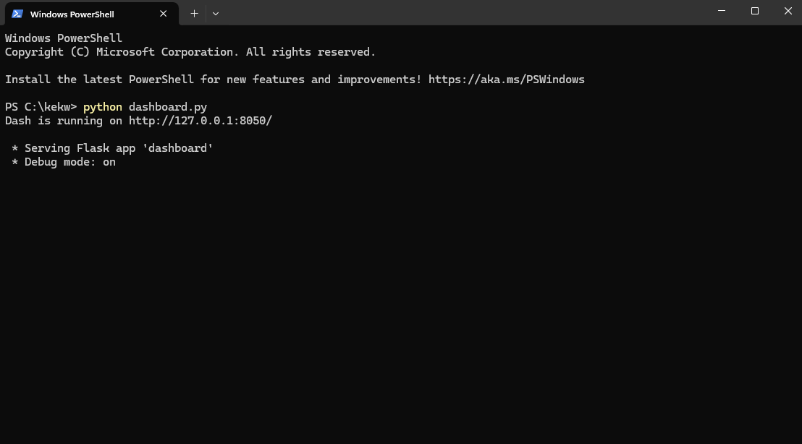

# Interactive Data Visualization Dashboard

This repository contains an interactive data visualization dashboard built using Python's Dash framework. The dashboard provides dynamic filtering, annotation capabilities, and downloadable datasets. It is designed for users who want to plug in their datasets and analyze them easily.

---

## Features

- **Dynamic Line Graphs**: Visualize trends for multiple categories, including toggling visibility for individual categories.
- **Category-Specific Graphs**: Display trends for individual categories side-by-side.
- **Data Table**: View filtered data dynamically in a table format.
- **Annotations**: Add and delete annotations on the main graph.
- **Data Download**: Export the dataset being analyzed.

---

## Prerequisites

Ensure you have Python 3.7+ installed and the following Python libraries:

```bash
pip install dash flask pandas plotly
```

---

## Setting Up

### 1. Clone the Repository

```bash
git clone <repository-url>
cd <repository-folder>
```

### 2. Prepare Your Dataset

- Replace the existing `sample_data_visualization.csv` file with your dataset.
- If your CSV has different column names, update the `dashboard.py` file:

```python
df = pd.read_csv('sample_data_visualization.csv')
```

Replace references to the default columns (`Timestamp`, `Value`, `Category`, `Region`) in all callbacks and layout components to match your column names.

#### Example Dataset

```csv
Date,Amount,Type,Location
2023-01-01,100,Food,North
2023-01-02,200,Travel,East
2023-01-03,150,Utilities,West
```

Update the relevant parts of the code:

```python
df = pd.read_csv('sample_data_visualization.csv')
# Replace 'Timestamp', 'Value', 'Category', 'Region' with 'Date', 'Amount', 'Type', 'Location'
```

### 3. Run the Application

Execute the script to launch the dashboard:

```bash
python dashboard.py
```

### 4. Access the Dashboard

Open your browser and navigate to:

```text
http://127.0.0.1:8050
```




---

## How to Use

### 1. Upload Your Dataset

- Place your `.csv` file in the same directory as `dashboard.py`.
- Ensure the file is named `sample_data_visualization.csv` or update the file path in the `df` initialization line:

```python
df = pd.read_csv('your_dataset.csv')
```

### 2. Filter Data

- Use the range slider to filter values by range.
- Select categories and regions using the dropdown menus.

### 3. Toggle Categories

- Use the checklist above the main graph to toggle specific categories on or off.

### 4. Annotate Data

- Click on the main graph to select a point.
- Enter a note in the text box and click **Add Annotation**.
- Remove all annotations by clicking **Delete Annotations**.

### 5. Export Data

- Click **Download Data** to export the current dataset as a `.csv` file.

---

## Customizing for Your Needs

### Add New Graphs

- Add new `dcc.Graph` components to the layout.
- Update the corresponding callback functions to process and display data for the new graphs.

### Modify Filtering Options

- Extend the filtering dropdowns or sliders to include new criteria by updating their respective components and callbacks.

### Connect to a Database or API

- Replace the static CSV loading (`pd.read_csv`) with a dynamic database or API call in the `df` initialization.

---

## Troubleshooting

### No Data Displayed

- Ensure the column names in your dataset match those referenced in the code.
- Verify the data types for each column are compatible with their intended usage (e.g., dates for time-series, numbers for values).

### Missing Dependencies

- Run the installation command again:

```bash
pip install dash flask pandas plotly
```

---

## Contributions

Feel free to fork this repository

---

